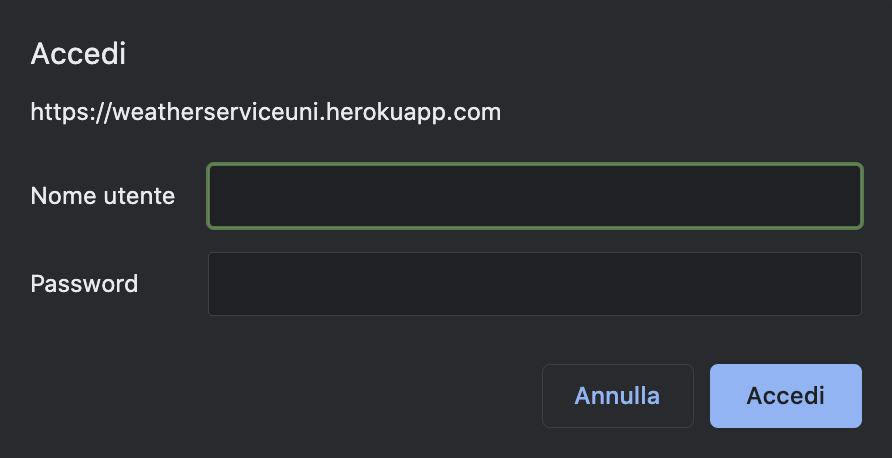
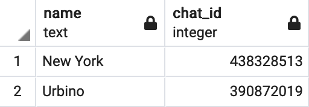

# Choices

- Programming language: **Python**
- Framework: **Flask**
- WSGI: **Gunicorn**
- Authentication: **Basic Authentication**
- DBMS: **PostgreSQL**
- Client: **Telegram Bot**

------------

## Authentication
The authentication method employed here is the Basic access Authentication method (BA).\
This means that for every created path in the web service a pop up
will appear asking for the credentials (username and password) specified in the WWW-Authenticate
header.

  

------------

## Data Format

The data output is in JSON format.

------------

## Database
The messages coming from the user, in particular the name of the cities the user 
wants to get information about, are stored in a database.\
This way, the telegram bot will be able to retrieve information on the weather
for the last city the user wrote in the chat.

  

PostgreSQL was the DBMS adopted.

------------

## Telegram

The client chosen for the realization of this project
is a Telegram bot created using [BotFather](http://telegram.me/botfather). \
After obtaining the token to access the HTTP API, a selection of commands, a description, and a photo were added to the newly created bot.
