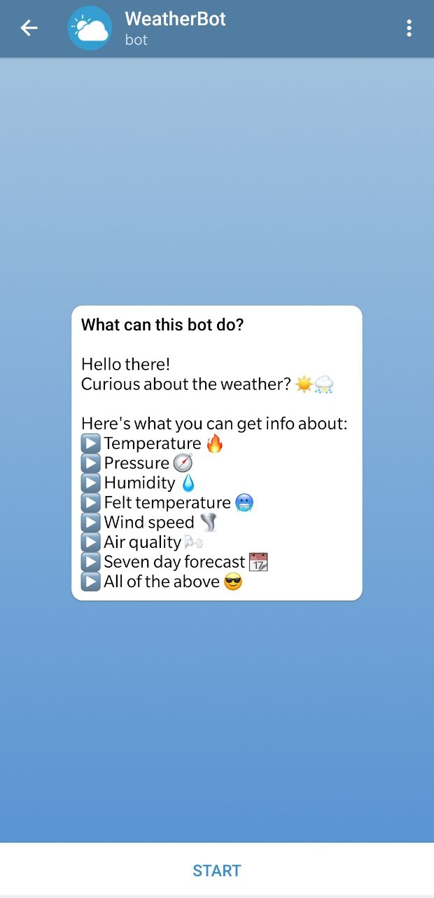
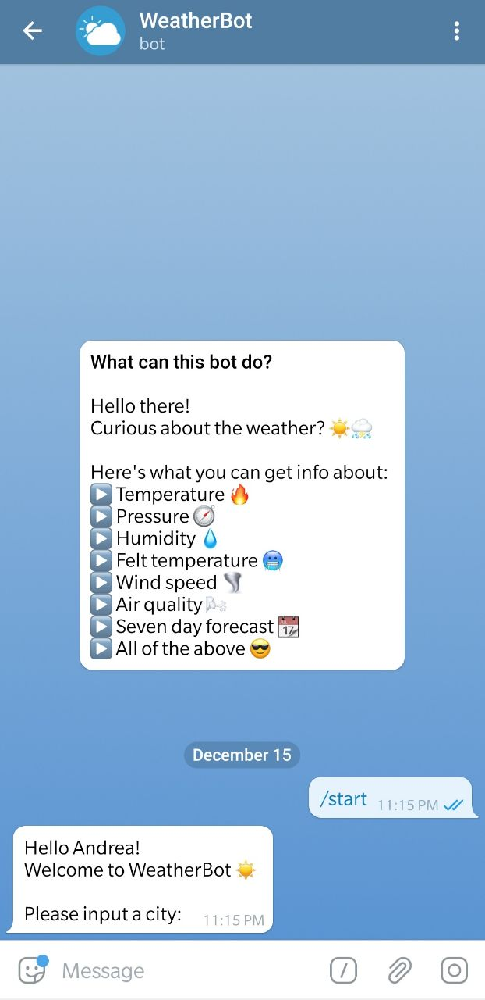
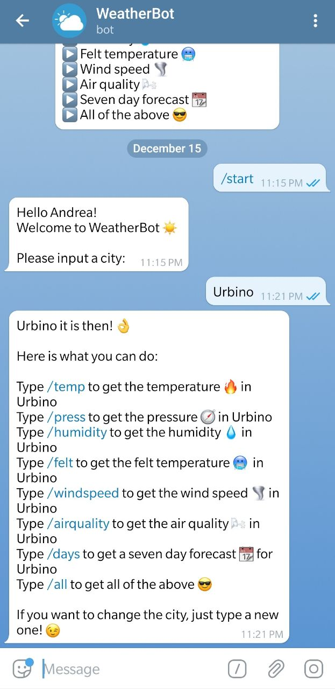
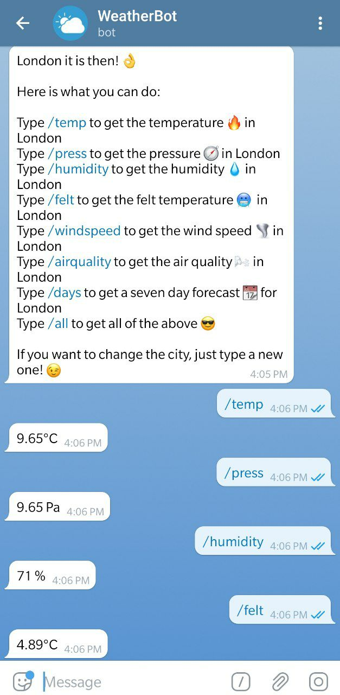
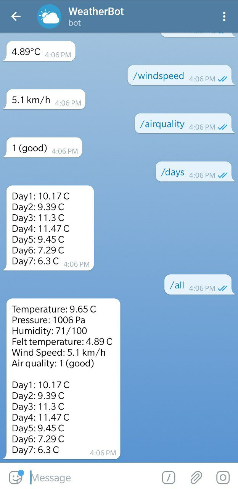
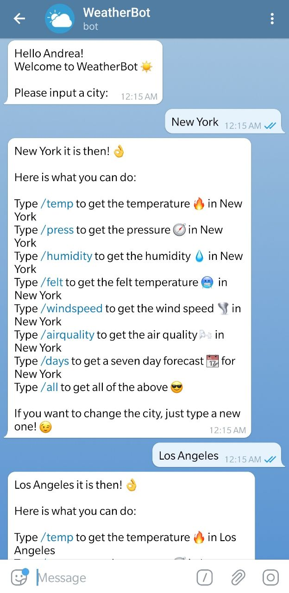

# User guide

## Telegram
The created Telegram bot can be found on Telegram typing **WeatherUniBot**
or by clicking here: [WeatherBot](https://t.me/weatherunibot)

### Bot Description
The user is welcomed with the bot description:

  

### Starting the bot

To **start** the bot the user needs to click on "Start".\
The user will be then asked to write the name of the city 
he wants to know the weather of.

  
  

Once the city is set, the user can select one of the following:

* **Temperature**
* **Pressure**
* **Humidity**
* **Felt temperature**
* **Wind speed**
* **Air quality**
* **Seven-day forecast**

Or even get **all** of them combined.

  
  

After getting all the information needed, a **new city** can be selected
by typing its name.

  

